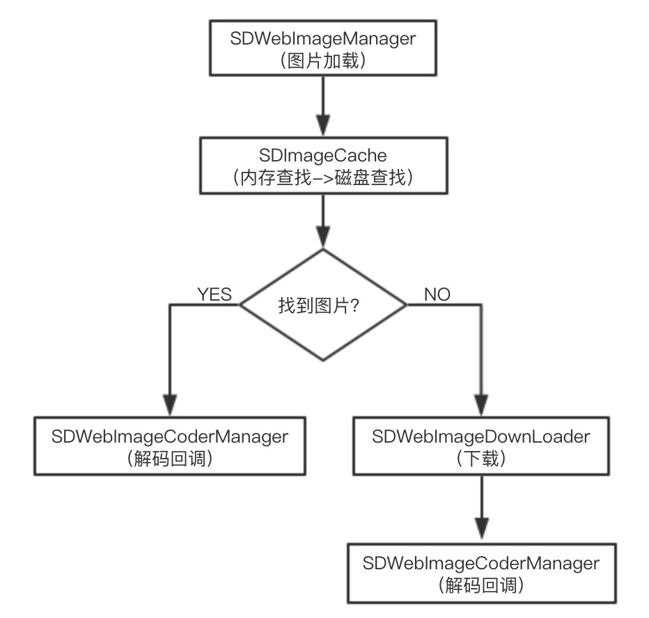

## SDWebImage解析
### 核心类，每个类分别负责对应的模块
| 核心类 | 功能模块 |
| :------------- | :------------- |
| SDWebImageManager | 调度各个类 |
| SDWebImageDownLoader | 下载模块 |
| SDImageCache | 缓冲（内存缓存和磁盘缓存 |
| SDWebImageCoderManager | 图片解码 |
`几个类的关系如下：`



---
### SDWebImageManager
---
#### 主要流程
- 第一步：调用`UIImageView+WebCache`的`- (void)sd_setImageWithURL:(NSURL *)url`方法。
- 第二步：然后来到`- (id <SDWebImageOperation>)downloadImageWithURL: options: progress: completed:`，
这个是`SDWebImageManager`的方法。
- 第三部：经过一番操作，返回结果。

#### 源码解析
```
- (id <SDWebImageOperation>)downloadImageWithURL:(NSURL *)url
                                         options:(SDWebImageOptions)options
                                        progress:(SDWebImageDownloaderProgressBlock)progressBlock
                                       completed:(SDWebImageCompletionWithFinishedBlock)completedBlock {
    // Invoking this method without a completedBlock is pointless
    NSAssert(completedBlock != nil, @"If you mean to prefetch the image, use -[SDWebImagePrefetcher prefetchURLs] instead");

    // 容错处理
    if ([url isKindOfClass:NSString.class]) {
        url = [NSURL URLWithString:(NSString *)url];
    }

    // 防止参错类型错误而导致应用程序奔溃，如发生NSNull而不是NSURL
    if (![url isKindOfClass:NSURL.class]) {
        url = nil;
    }
    // 创建操作组合
    __block SDWebImageCombinedOperation *operation = [SDWebImageCombinedOperation new];
    __weak SDWebImageCombinedOperation *weakOperation = operation;

    BOOL isFailedUrl = NO;
    @synchronized (self.failedURLs) {
        // 检查当前连接是否失效过。
        isFailedUrl = [self.failedURLs containsObject:url];
    }

    if (url.absoluteString.length == 0 || (!(options & SDWebImageRetryFailed) && isFailedUrl)) {
        dispatch_main_sync_safe(^{
            NSError *error = [NSError errorWithDomain:NSURLErrorDomain code:NSURLErrorFileDoesNotExist userInfo:nil];
            completedBlock(nil, error, SDImageCacheTypeNone, YES, url);
        });
        return operation;
    }
    /*
      将任务添加到runningOperations
      runningOperations是存放正在load的所有操作集合
    */
    @synchronized (self.runningOperations) {
        [self.runningOperations addObject:operation];
    }
    NSString *key = [self cacheKeyForURL:url];
    // 在load是，让imageCache先去缓存中去取，如果取不到，再去下载
    operation.cacheOperation = [self.imageCache queryDiskCacheForKey:key done:^(UIImage *image, SDImageCacheType cacheType) {
        // 内存和磁盘查找结束后，来到这里，然后主线程回调

        // 如果检测到操作被取消，则直接return
        if (operation.isCancelled) {
            @synchronized (self.runningOperations) {
                [self.runningOperations removeObject:operation];
            }
            return;
        }
        // 如果从缓存中没有找到图片，且允许下载
        if ((!image || options & SDWebImageRefreshCached) && (![self.delegate respondsToSelector:@selector(imageManager:shouldDownloadImageForURL:)] || [self.delegate imageManager:self shouldDownloadImageForURL:url])) {
             // 如果满足条件，开始下载
            if (image && options & SDWebImageRefreshCached) {
                dispatch_main_sync_safe(^{
                    // If image was found in the cache but SDWebImageRefreshCached is provided, notify about the cached image
                    // 如果在缓冲中找到了图片但提供了SDWebImageRefreshCached，则通知缓存图像
                    // AND try to re-download it in order to let a chance to NSURLCache to refresh it from server.
                    // 并尝试重新下载，以便让NSURLCache有机会从服务器更新它
                    completedBlock(image, nil, cacheType, YES, url);
                });
            }

            // download if no image or requested to refresh anyway, and download allowed by delegate
            SDWebImageDownloaderOptions downloaderOptions = 0;
            if (options & SDWebImageLowPriority) downloaderOptions |= SDWebImageDownloaderLowPriority;
            if (options & SDWebImageProgressiveDownload) downloaderOptions |= SDWebImageDownloaderProgressiveDownload;
            if (options & SDWebImageRefreshCached) downloaderOptions |= SDWebImageDownloaderUseNSURLCache;
            if (options & SDWebImageContinueInBackground) downloaderOptions |= SDWebImageDownloaderContinueInBackground;
            if (options & SDWebImageHandleCookies) downloaderOptions |= SDWebImageDownloaderHandleCookies;
            if (options & SDWebImageAllowInvalidSSLCertificates) downloaderOptions |= SDWebImageDownloaderAllowInvalidSSLCertificates;
            if (options & SDWebImageHighPriority) downloaderOptions |= SDWebImageDownloaderHighPriority;
            if (image && options & SDWebImageRefreshCached) {
                // force progressive off if image already cached but forced refreshing
                downloaderOptions &= ~SDWebImageDownloaderProgressiveDownload;
                // ignore image read from NSURLCache if image if cached but force refreshing
                downloaderOptions |= SDWebImageDownloaderIgnoreCachedResponse;
            }
            id <SDWebImageOperation> subOperation = [self.imageDownloader downloadImageWithURL:url options:downloaderOptions progress:progressBlock completed:^(UIImage *downloadedImage, NSData *data, NSError *error, BOOL finished) {
                __strong __typeof(weakOperation) strongOperation = weakOperation;
                if (!strongOperation || strongOperation.isCancelled) {
                    // Do nothing if the operation was cancelled
                    // See #699 for more details
                    // if we would call the completedBlock, there could be a race condition between this block and another completedBlock for the same object, so if this one is called second, we will overwrite the new data
                }
                else if (error) {
                    dispatch_main_sync_safe(^{
                        if (strongOperation && !strongOperation.isCancelled) {
                            completedBlock(nil, error, SDImageCacheTypeNone, finished, url);
                        }
                    });

                    if (   error.code != NSURLErrorNotConnectedToInternet
                        && error.code != NSURLErrorCancelled
                        && error.code != NSURLErrorTimedOut
                        && error.code != NSURLErrorInternationalRoamingOff
                        && error.code != NSURLErrorDataNotAllowed
                        && error.code != NSURLErrorCannotFindHost
                        && error.code != NSURLErrorCannotConnectToHost) {
                        @synchronized (self.failedURLs) {
                            [self.failedURLs addObject:url];
                        }
                    }
                }
                else {
                    if ((options & SDWebImageRetryFailed)) {
                        @synchronized (self.failedURLs) {
                            [self.failedURLs removeObject:url];
                        }
                    }

                    BOOL cacheOnDisk = !(options & SDWebImageCacheMemoryOnly);

                    if (options & SDWebImageRefreshCached && image && !downloadedImage) {
                        // Image refresh hit the NSURLCache cache, do not call the completion block
                    }
                    else if (downloadedImage && (!downloadedImage.images || (options & SDWebImageTransformAnimatedImage)) && [self.delegate respondsToSelector:@selector(imageManager:transformDownloadedImage:withURL:)]) {
                        dispatch_async(dispatch_get_global_queue(DISPATCH_QUEUE_PRIORITY_HIGH, 0), ^{
                            UIImage *transformedImage = [self.delegate imageManager:self transformDownloadedImage:downloadedImage withURL:url];

                            if (transformedImage && finished) {
                                BOOL imageWasTransformed = ![transformedImage isEqual:downloadedImage];
                                [self.imageCache storeImage:transformedImage recalculateFromImage:imageWasTransformed imageData:(imageWasTransformed ? nil : data) forKey:key toDisk:cacheOnDisk];
                            }

                            dispatch_main_sync_safe(^{
                                if (strongOperation && !strongOperation.isCancelled) {
                                    completedBlock(transformedImage, nil, SDImageCacheTypeNone, finished, url);
                                }
                            });
                        });
                    }
                    else {
                        if (downloadedImage && finished) {
                            [self.imageCache storeImage:downloadedImage recalculateFromImage:NO imageData:data forKey:key toDisk:cacheOnDisk];
                        }

                        dispatch_main_sync_safe(^{
                            if (strongOperation && !strongOperation.isCancelled) {
                                completedBlock(downloadedImage, nil, SDImageCacheTypeNone, finished, url);
                            }
                        });
                    }
                }

                if (finished) {
                    @synchronized (self.runningOperations) {
                        if (strongOperation) {
                            [self.runningOperations removeObject:strongOperation];
                        }
                    }
                }
            }];
            operation.cancelBlock = ^{
                [subOperation cancel];

                @synchronized (self.runningOperations) {
                    __strong __typeof(weakOperation) strongOperation = weakOperation;
                    if (strongOperation) {
                        [self.runningOperations removeObject:strongOperation];
                    }
                }
            };
        }
        else if (image) {
            dispatch_main_sync_safe(^{
                __strong __typeof(weakOperation) strongOperation = weakOperation;
                if (strongOperation && !strongOperation.isCancelled) {
                    completedBlock(image, nil, cacheType, YES, url);
                }
            });
            @synchronized (self.runningOperations) {
                [self.runningOperations removeObject:operation];
            }
        }
        else {
            // Image not in cache and download disallowed by delegate
            dispatch_main_sync_safe(^{
                __strong __typeof(weakOperation) strongOperation = weakOperation;
                if (strongOperation && !weakOperation.isCancelled) {
                    completedBlock(nil, nil, SDImageCacheTypeNone, YES, url);
                }
            });
            @synchronized (self.runningOperations) {
                [self.runningOperations removeObject:operation];
            }
        }
    }];

    return operation;
}
```
